# __Linux Distropedia - Portfolio Project 4__
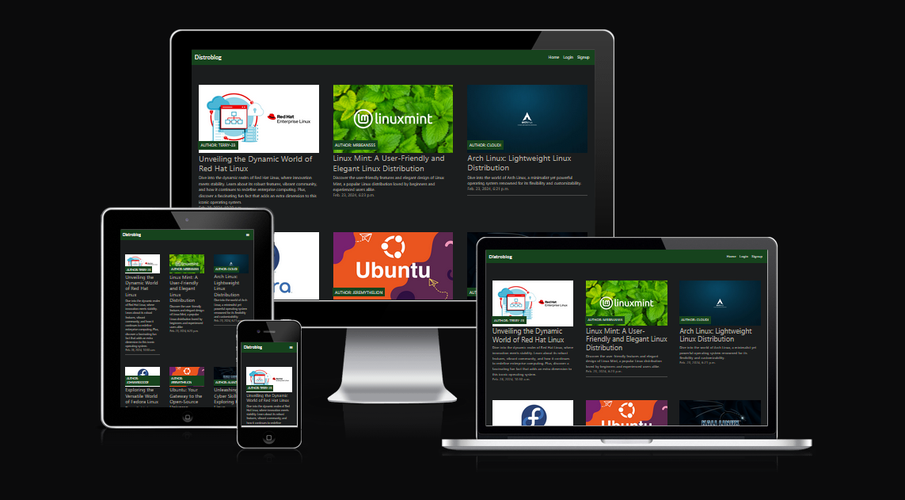

Distropedia is a blog site where users can create an account an contribute to the Page by creating their own blogs. Users are able to like and comment under posts.

The aim of this project is to have for information about different Linux Distros and connect with like-minded people.

[Live link to website](https://linuxdistropedia-d0c59f414e1b.herokuapp.com/)

## User Stories

The user stories can be found [here](https://github.com/alex025x/linux-distropedia/issues)

## Wireframes

I used [balsamiq](https://balsamiq.com/wireframes) to design my site wireframes.

Click to view home page wireframes

#### Mobile
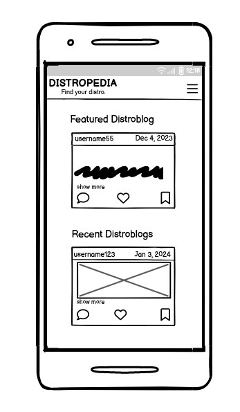

#### PC
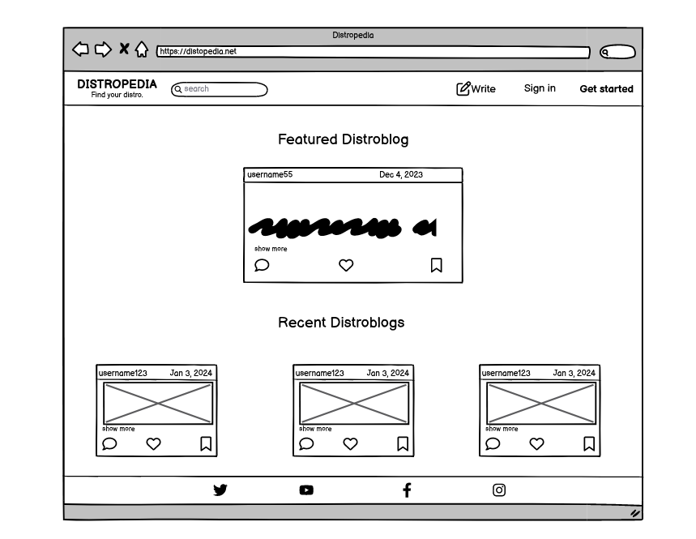

### ERD Diagram Wireframe

Click here to view ERD Wireframe

### ERD Wireframe (Post, Comment, Like)
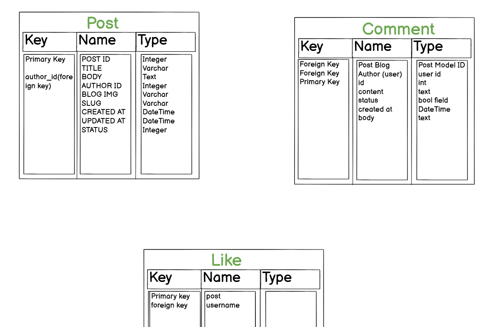

### Existing features

- **Home page Logged out**

    -When users visit the blog they have a home, register and login navigation, users can see the blog posts including the author, time and date when the post was uploaded and the numbers of likes.

    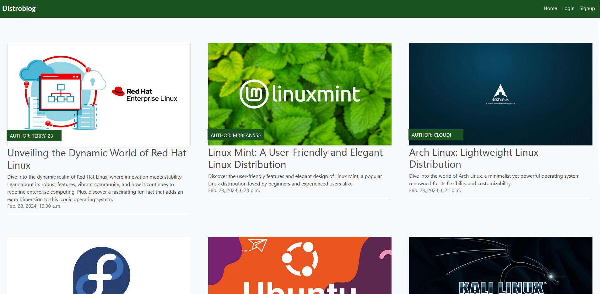

- **Login Or Sign Up**

    -When users click on sign up they can sign up or if they already have an account the can sign in.

    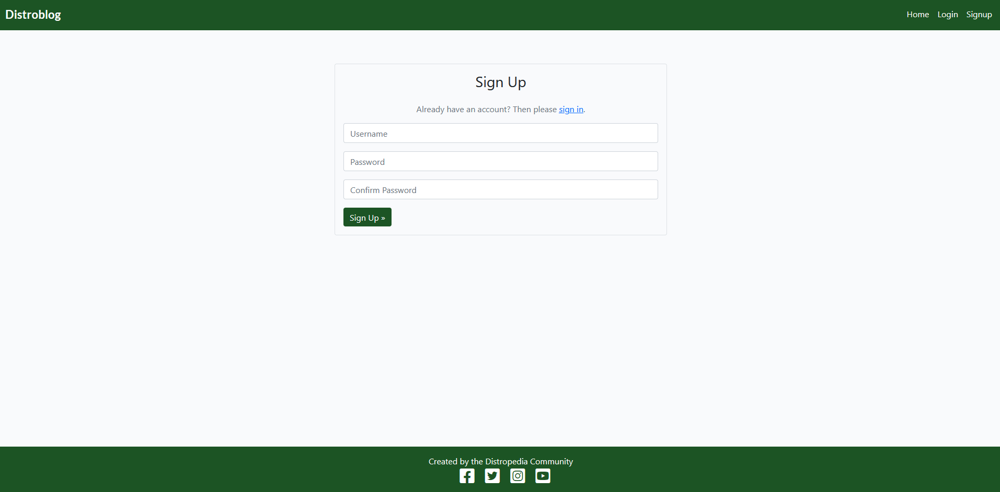

    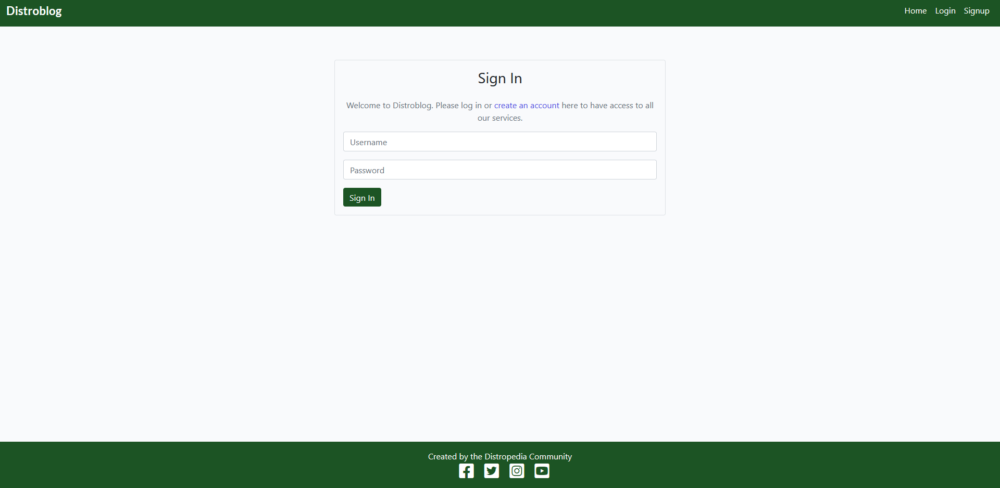

    -After loggin in users get a message letting them know they successfully signed in.

    

- **Comment**

    -Logged in users can leave a comment by filling the form.

    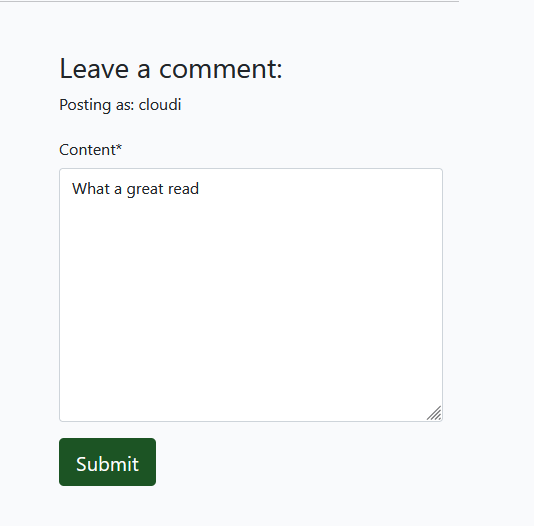

    -After hitting submit user will get a confirmation message letting them know that their comment is under approval

    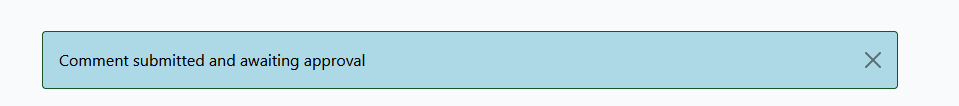

    -Users can also of course delete or edit their comments if they wish to do so

    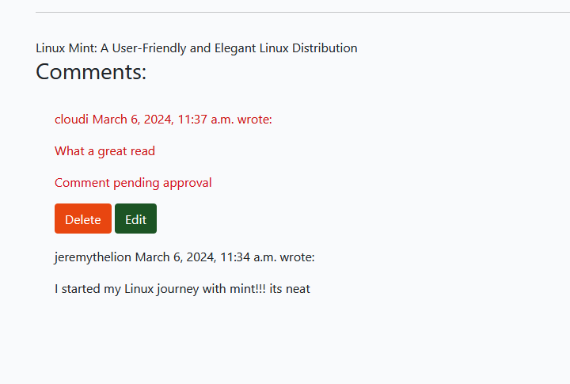

- **Create Blog**

    -If users wish they can click on create Blog in the navbar and they will be able to add a Blog.

    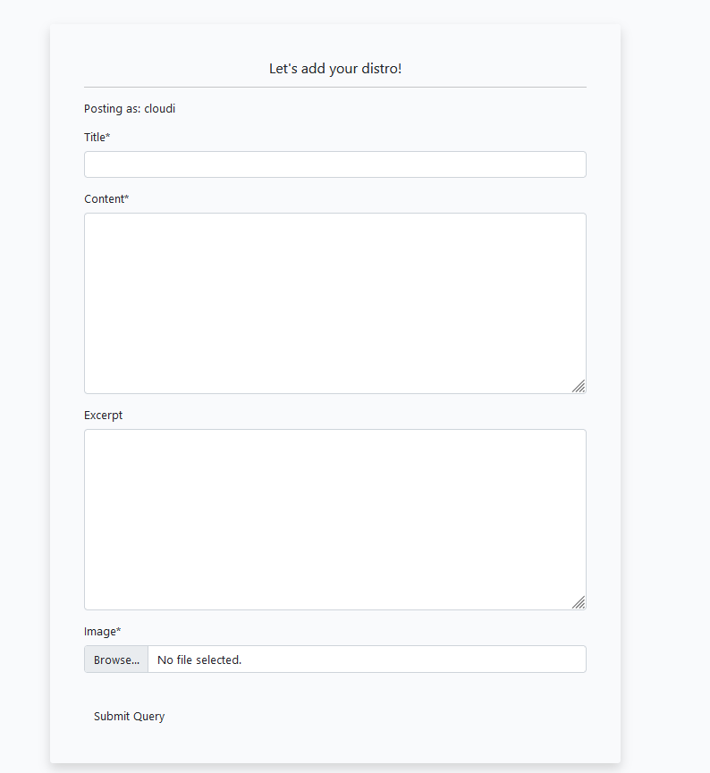

- **Log Out**

    -If users wish they can also log out of the page and they will receive a message letting them know so. 

    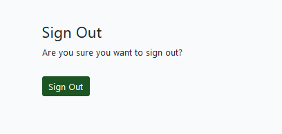

    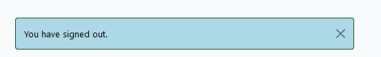

## Agile Development

    -For Agile Development I have used Github [Projects](https://github.com/users/alex025x/projects/3)

## Testing

For all testing, please refer to the [TESTING.md](TESTING.md) file.

### ElpephantSQL 

This project uses [ElephantSQL](https://www.elephantsql.com/) for postgreSQL database.

### Cloudinary API 

This project uses the [Cloudinary API](https://cloudinary.com/) to store media assets online.

To obtain your own cloudinary API key, create an account and log in.
- For **Primary interest**, you can choose **programmable media for image and video API**.
- On your cloudinary dashboard, you can copy your **API enviroment variable*

### Heroku Deployment

This project uses [Heroku](https://www.heroku.com/), a platform as a service that enables developers to build, run and operate applications entirely in the cloud.

## Credits

I would like to credit [Code Institute](https://codeinstitute.net/) for allowing us to use the *I think therefore I blog* practice project as a base to our own blog.

 ##  Acknowledgement

 I would like to thank:

 - My mentor Jack Wachira
 - Codeinstiute for the Student Support and examples
 - I would like to thank the assessment team for taking their time to look over my project