# Testing

Return back to the [README.md](README.md) file.

## Code validation

### HTML

I have used the recommened [HTML w3c validator](https://validator.w3.org/) to test and validate all of my html files.

| Pages | Screenshots | Notes |
| --- | --- | --- |
| Home | 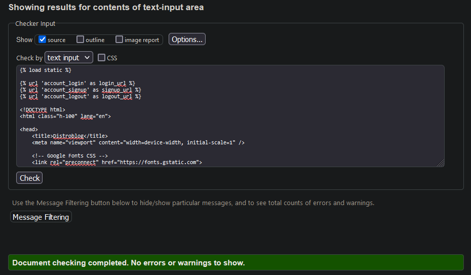 | Pass: no errors |
| Post Details| 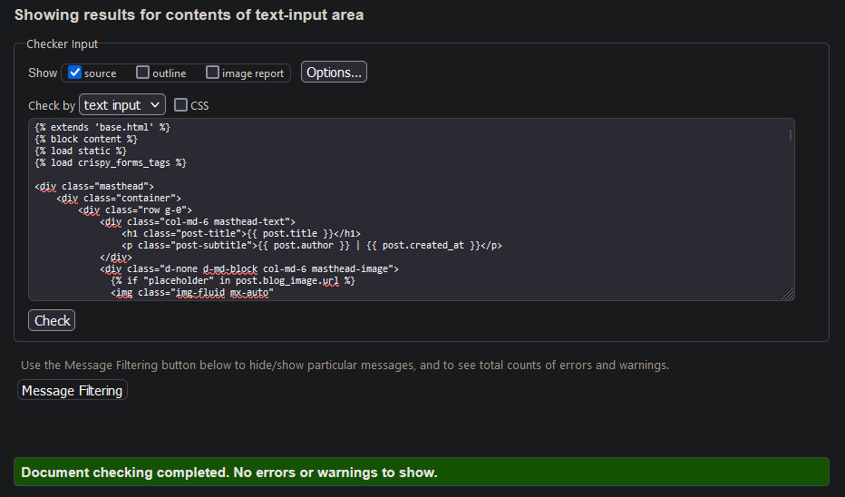 | Pass: no errors |
| Create Blog | 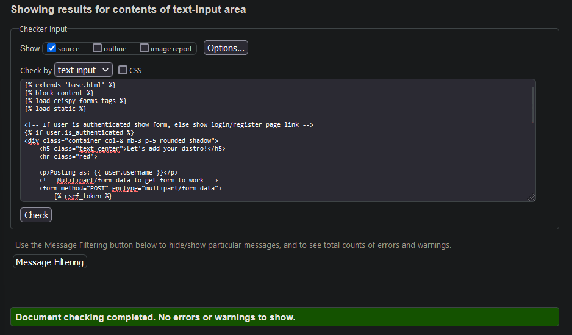 | Pass: no errors |
| Blog entries| 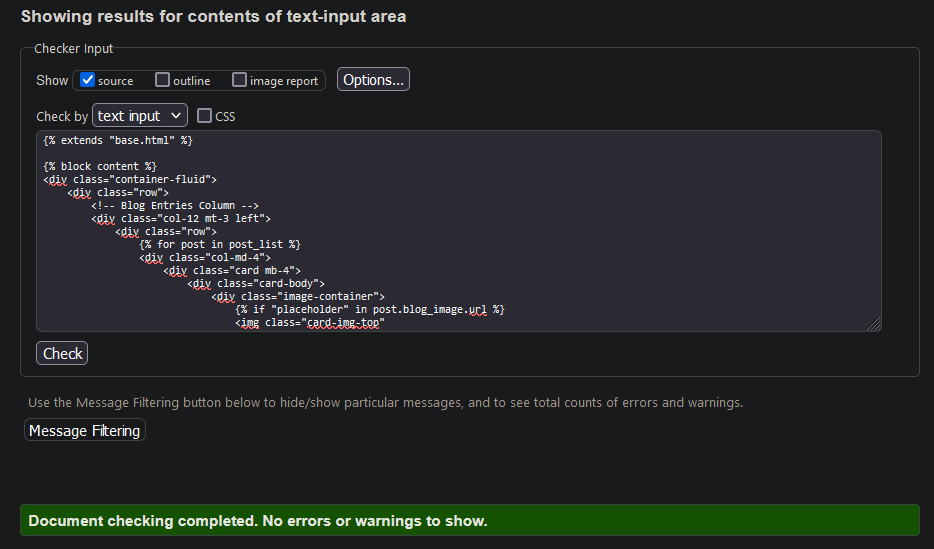 | Pass: no errors |
| Login | 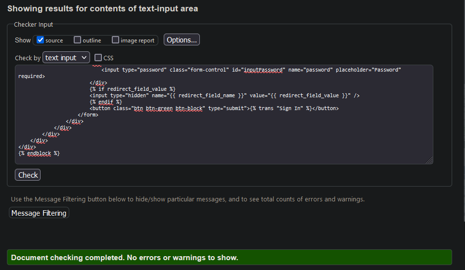 | Pass: no errors |
| Sign up | 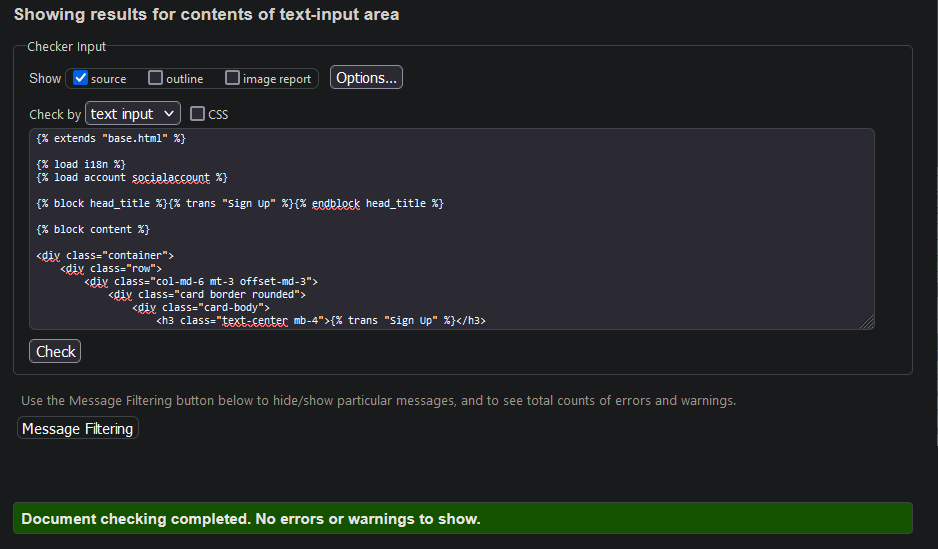 | Pass: no errors |
| Log out | 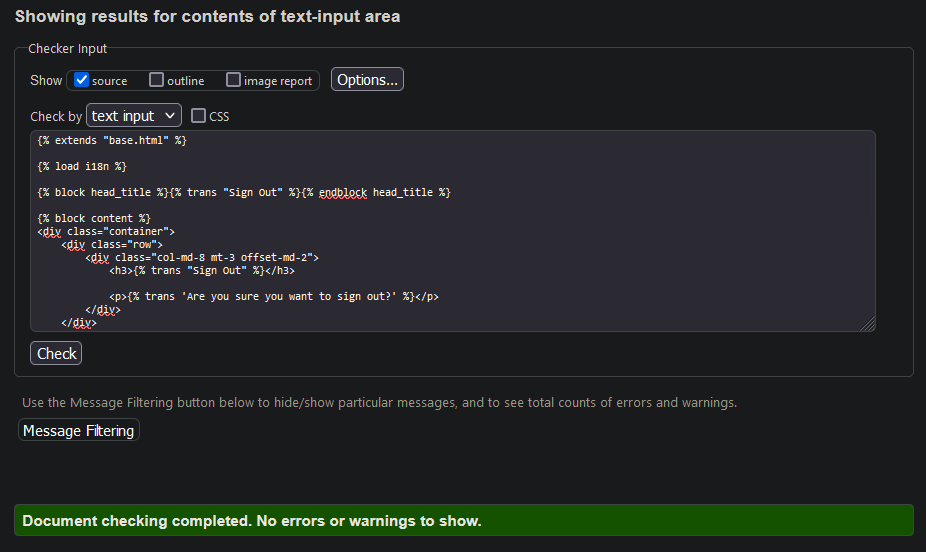 | Pass: no major errors |

### CSS
 
 I have used the recommneded [CSS Jigsaw validator](https://jigsaw.w3.org/css-validator/) to validate my css file.

| File | Screenshot | Notes |
| --- | --- | --- |
| style.css | 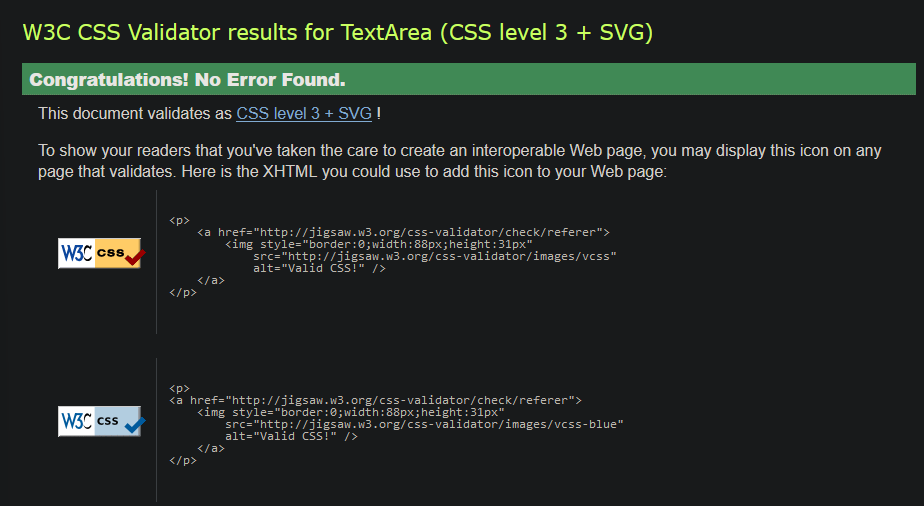 | Pass: no errors |

### JavaScript

I have used [JShint validator](https://jshint.com/) to validate my javascript code that is found in my comments.js file.

| File | Screenshot | Notes |
| --- | --- | --- |
| Comments| 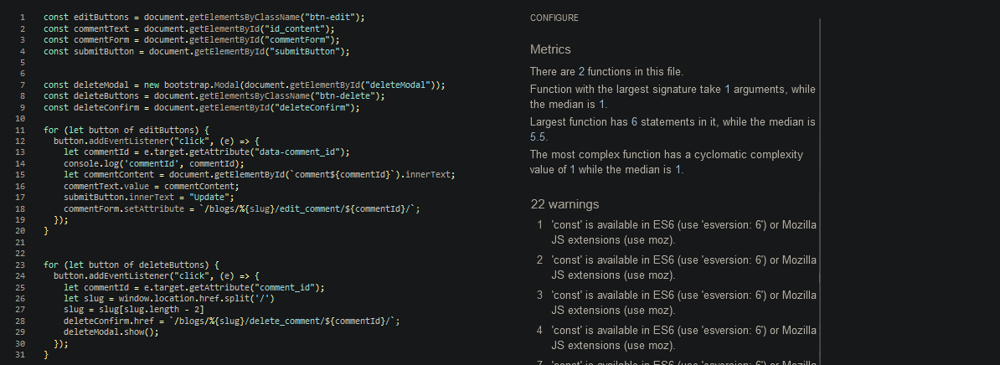 | Pass: no errors |

### Python

I have used [CI Python linter](https://pep8ci.herokuapp.com/) to validate all of my python files.

| File | Screenshot | Notes |
| --- | --- | --- |
| Admin | 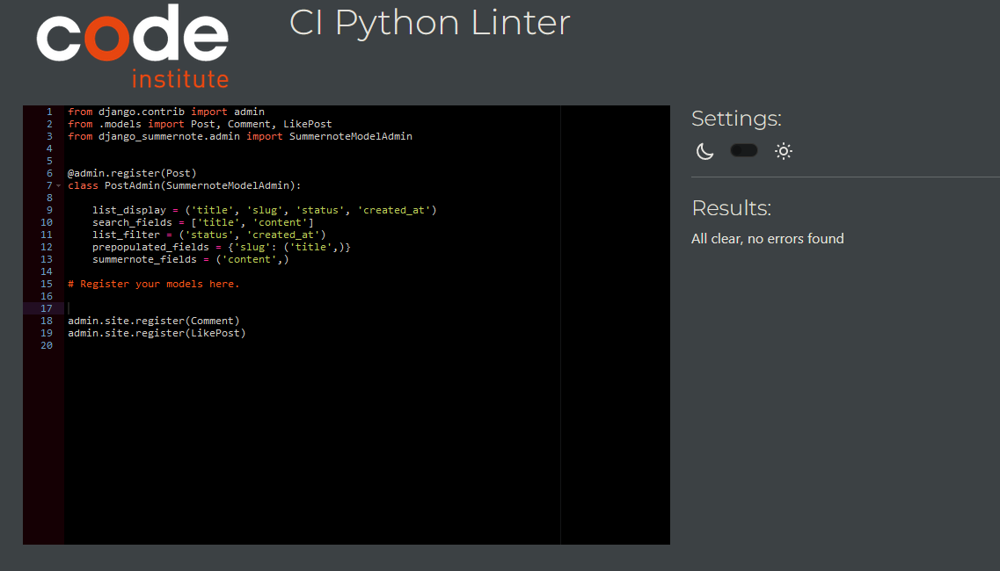 | Pass: no errors |
| Models | 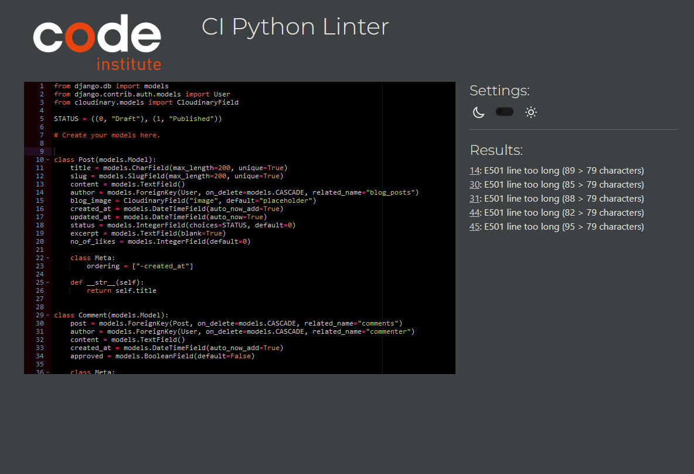 | Pass: no errors |
| Urls |  | Pass: no errors |
| Forms |  | Pass: no errors |

## Responsivness

I have checked my deployed site on phone and tabet to make sure each page was responsive.
